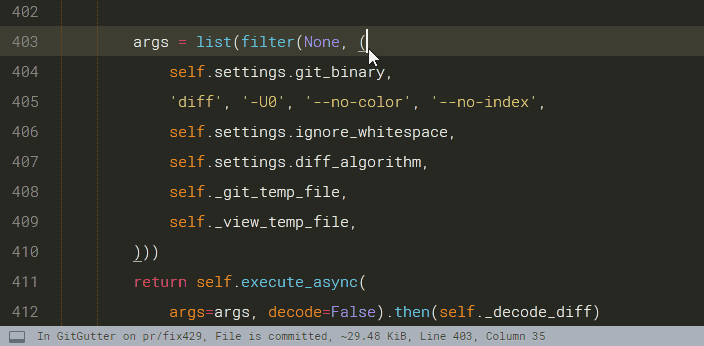
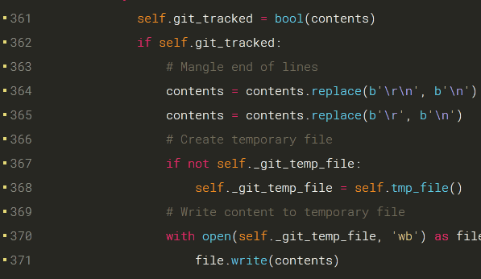

# GitGutter

A [Sublime Text](http://www.sublimetext.com) plug-in to show information about files in a git repository:

1. _Gutter Icons_ indicating inserted, modified or deleted lines
2. _Diff Popup_ with details about modified lines
3. _Status Bar Text_ with information about file and repository

and provides some commands like:

1. _Goto Change_ to navigate between modified lines
2. _Copy from Commit_ to copy the original content from the commit
3. _Revert to Commit_ to revert a modified hunk to the original state in a commit

## Gutter Icons & Status Bar Text

The icons of the default theme have the following meaning:

 Icon          | Description
:-------------:|-------------------------
![inserted][]  | inserted line
![changed][]   | modified line
![deleted][]   | deleted region borders
![ignored][]   | ignored file
![untracked][] | untracked file

[changed]: <docs/assets/images/gutter_changed.png>
[deleted]: <docs/assets/images/gutter_deleted.png>
[ignored]: <docs/assets/images/gutter_ignored.png>
[inserted]: <docs/assets/images/gutter_inserted.png>
[untracked]: <docs/assets/images/gutter_untracked.png>

## Diff Popup

The diff popup shows the original content from the commit or the differences between it and the working content.

ⓘ _requires Sublime Text 3 Build 3124+ and mdpopups 2.0.0+_

The toolbar provides some commands to interact with or modify the changes.

 symbol | meaning of the symbol
 :-----:| ---------------------------------------
 ×      | close the popup
 ⤒      | goto to first change
 ↑      | goto to previous change
 ↓      | goto to next change
 ≈, ≉   | enable/disable difference highlighting
 ⎘      | copy the original content from the commit
 ⟲      | revert a modified hunk to the original state in a commit

## Documentaion

Please read https://jisaacks.github.io/GitGutter/ for detailed information about

- [Installation](https://jisaacks.github.io/GitGutter/install)
- [Usage](https://jisaacks.github.io/GitGutter/usage)
- [Settings](https://jisaacks.github.io/GitGutter/settings)
- [Troubleshooting](https://jisaacks.github.io/GitGutter/troubleshooting)
